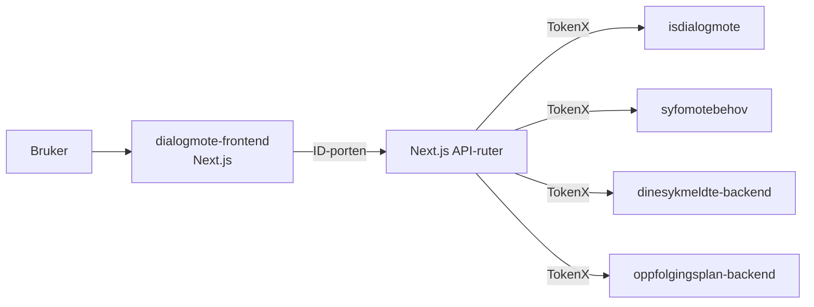

# Dialogmøter for sykmeldte og arbeidsgivere

[](https://github.com/navikt/dialogmote-frontend/actions/workflows/build-and-deploy.yaml)


Frontend for dialogmøter på `nav.no`. Appen viser innhold for både sykmeldte og arbeidsgivere under `/syk/dialogmoter`, og henter data via egne Next.js API-ruter som snakker med backend-tjenester i NAV.

## Formål

Repoet inneholder en Next.js-app for:

- sykmeldt-flaten på `/syk/dialogmoter`
- arbeidsgiver-flaten på `/syk/dialogmoter/arbeidsgiver/[narmestelederid]`
- visning og innsending av motebehov
- visning av møteinnkallinger og referater

## Arkitektur



Appen bruker ID-porten-sidecar i NAIS og gjør TokenX on-behalf-of-utveksling mot interne tjenester.

## Miljøer

- Prod: https://www.nav.no/syk/dialogmoter
- Dev: https://www.ekstern.dev.nav.no/syk/dialogmoter

Repoet har også et demo-manifest for branchdeploy med mock-backend.

## Backend og integrasjoner

Frontendens API-ruter ligger under `src/pages/api` og bruker disse tjenestene:

- `isdialogmote` for brev, møteinnkallinger og referater
- `syfomotebehov` for motebehov
- `dinesykmeldte-backend` for oppslag av sykmeldt i arbeidsgiverflyten
- `oppfolgingsplan-backend` for arbeidsgiverrelaterte oppslag

I tillegg brukes:

- NAV dekoratøren
- NAV CDN for opplasting av sjelden endrede filer i `public/`
- Grafana Faro for frontend-telemetri

## Utviklerverktøy

Repoet har `.mise.toml` med:

- Node.js 24
- pnpm 10

Nyttige kommandoer med mise:

```bash
mise run install
mise run dev
mise run test
mise run build
mise run verify
```

## Utvikling

### Installer avhengigheter

Repoet bruker GitHub Package Registry for `@navikt`-pakker og krever en PAT med `package:read`.

1. Opprett token på https://github.com/settings/tokens
2. Eksporter token:

```bash
export NPM_AUTH_TOKEN=<PAT>
```

3. Installer avhengigheter:

```bash
pnpm install
```

### Start appen lokalt

```bash
pnpm run dev
```

Appen starter på http://localhost:3000 med base path `/syk/dialogmoter`.

### Nyttige kommandoer

```bash
pnpm run check
pnpm run test
pnpm run build
```

## For NAV-ansatte

- Team: `team-esyfo`
- Appnavn i NAIS: `dialogmote-frontend`
- Deploy skjer via workflowen `Build & Deploy`
- Offentlige assets lastes opp via workflowen `Upload rarely changed public files to NAV CDN`
