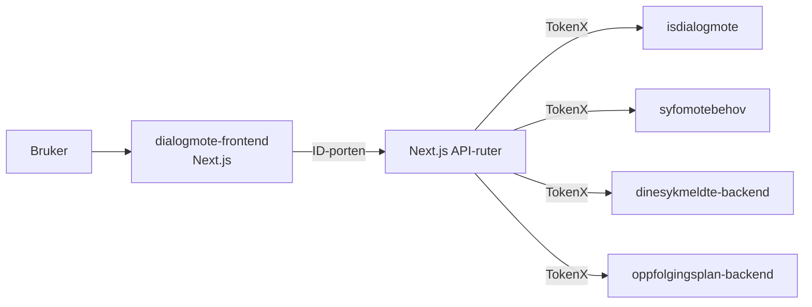

# Dialogmøter for sykmeldte og arbeidsgivere

Frontend for dialogmøter på `nav.no`. Appen viser innhold for både sykmeldte og arbeidsgivere under `/syk/dialogmoter`, og henter data via Next.js API-ruter som snakker med backend-tjenester.

## Miljøer

- [🚀 Produksjon](https://www.nav.no/syk/dialogmoter)
- [🛠️ Utvikling](https://www.ekstern.dev.nav.no/syk/dialogmoter)
- [🎬 Demo - arbeidstaker](https://demo.ekstern.dev.nav.no/syk/dialogmoter/sykmeldt)
- [🎬 Demo - arbeidsgiver](https://demo.ekstern.dev.nav.no/syk/dialogmoter/arbeidsgiver/1)

## Formålet med appen

Appen håndterer dialogmøter mellom sykmeldte, arbeidsgivere og NAV som del av sykefraværsoppfølgingen. Den har to brukerflater:

### Sykmeldt (`/syk/dialogmoter`)

- **Møtebehov** — melde behov for dialogmøte og svare på forespørsler fra arbeidsgiver
- **Møteinnkalling** — se innkalling til dialogmøte fra NAV
- **Referat** — lese referater fra gjennomførte dialogmøter

### Arbeidsgiver (`/syk/dialogmoter/arbeidsgiver/[narmestelederid]`)

- **Møtebehov** — melde behov for dialogmøte på vegne av virksomheten og svare på forespørsler
- **Brev** — se innkallinger og referater knyttet til den sykmeldte

## Backend og integrasjoner

Frontendens API-ruter ligger under `src/pages/api` og bruker disse tjenestene:

- `isdialogmote` for brev, møteinnkallinger og referater
- `syfomotebehov` for møtebehov
- `dinesykmeldte-backend` for oppslag av sykmeldt i arbeidsgiverflyten
- `oppfolgingsplan-backend` for arbeidsgiverrelaterte oppslag

I tillegg brukes:

- NAV dekoratøren
- NAV CDN for opplasting av sjelden endrede filer i `public/`
- Grafana Faro for frontend-telemetri

## Utvikling (kjøre lokalt)

For å komme i gang med bygging og kjøring av appen, sjekk ut mise tasks.

## For NAV-ansatte

- Team: `team-esyfo`
- Appnavn i NAIS: `dialogmote-frontend`
- Deploy skjer via workflowen `Build & Deploy`
- Offentlige assets lastes opp via workflowen `Upload rarely changed public files to NAV CDN`
